<div align="center">

# 🦅 SECRET HITLER 🦅
### PASS & PLAY EDITION

[](https://github.com)
[](https://github.com)
[](https://github.com)


**A dramatic game of political intrigue and betrayal**

[🎮 **PLAY NOW**](#quick-start) • [📖 **RULES**](#how-to-play) • [🛠️ **SETUP**](#installation) • [💻 **CONTRIBUTE**](#development)

</div>

---

## 🎭 **ABOUT THE GAME**

> *The year is 1932. The place is pre-WWII Germany. In Secret Hitler, players are German politicians attempting to hold a fragile Liberal government together and stem the rising tide of Fascism.*

Secret Hitler is a dramatic game of **political intrigue and betrayal** for 5-10 players. Players are secretly divided into two teams: **Liberals** and **Fascists**. Known only to each other, the Fascists coordinate to sow distrust and install their cold-blooded leader. The Liberals must find and stop the Secret Hitler before it's too late.

### 🎯 **Victory Conditions**

| Team | How to Win |
|------|------------|
| 🔵 **LIBERALS** | • Pass 5 Liberal Policies<br>• Execute Hitler |
| 🔴 **FASCISTS** | • Pass 6 Fascist Policies<br>• Elect Hitler as Chancellor (after 3 Fascist policies) |

---

## ✨ **FEATURES**

<table>
<tr>
<td width="50%">

### 🎮 **Game Modes**
- **Pass & Play** - Single device gameplay
- **Online Multiplayer** - Play with remote friends
- **Demo Mode** - Interactive tutorial

</td>
<td width="50%">

### 🎨 **Authentic Design**
- 1930s propaganda poster aesthetic
- Original artwork and sound effects
- Responsive mobile-first interface

</td>
</tr>
<tr>
<td width="50%">

### 🔧 **Smart Features**
- Automatic game state management
- Real-time synchronization
- Offline mode with sync recovery

</td>
<td width="50%">

### 🛡️ **Security**
- Secure role assignment
- Anti-cheat protection
- Private game rooms with passwords

</td>
</tr>
</table>

---

## 🚀 **QUICK START**

### **Option 1: Play Online** 🌐
```bash
# Visit the hosted version
https://your-domain.com/secrethitler
```

### **Option 2: Local Development** 💻
```bash
# Clone the repository
git clone https://github.com/yourusername/PassAndPlaySH.git

# Navigate to project
cd PassAndPlaySH

# Start local server (using XAMPP, WAMP, or similar)
# Place in: C:\xampp\htdocs\PassAndPlaySH\

# Open in browser
http://localhost/PassAndPlaySH/
```

---

## 📖 **HOW TO PLAY**

### **🎯 Setup Phase**
1. **5-6 Players:** 3 Fascists (including Hitler), 3-4 Liberals
2. **7-8 Players:** 4 Fascists (including Hitler), 4-5 Liberals  
3. **9-10 Players:** 5 Fascists (including Hitler), 5-6 Liberals

### **🔄 Game Phases**

```mermaid
graph LR
    A[👑 President Nominates] --> B[🗳️ Vote on Government]
    B --> C{Pass?}
    C -->|Yes| D[📋 Legislative Session]
    C -->|No| E[❌ Failed Election]
    D --> F[⚡ Executive Action?]
    F --> G[🔄 Next Round]
    E --> G
```



### **📋 Legislative Session**
1. **President** draws 3 policy cards
2. **President** discards 1, passes 2 to Chancellor
3. **Chancellor** enacts 1, discards 1

### **⚡ Executive Powers** *(After certain Fascist policies)*
- **3rd Policy:** 🔍 Investigate loyalty
- **4th Policy:** 💀 Execute a player
- **5th Policy:** 💀 Execute a player

---

## 🎨 **DESIGN SYSTEM**

The game follows an authentic 1930s propaganda poster aesthetic:

| Element | Color | Hex Code | Usage |
|---------|-------|----------|-------|
| 🔵 **Liberal Blue** |  | `#00AEEF` | Liberal team elements |
| 🔴 **Fascist Red** |  | `#DA291C` | Fascist team elements |
| ⚫ **Propaganda Black** |  | `#252525` | Borders, text |
| 🟡 **Highlight Cream** |  | `#F1E6B2` | Backgrounds, accents |

**Typography:** Eskapade Fraktur (display), Futura PT (body)

---

## 🛠️ **INSTALLATION**

### **Prerequisites**
- Web server with PHP 7.4+ support
- MySQL 5.7+ or Firebase Firestore
- Modern web browser (Chrome 90+, Firefox 88+, Safari 14+)

### **Configuration**

1. **Database Setup**
```sql
-- Create database
CREATE DATABASE secrethitler;

-- Import schema
mysql -u root -p secrethitler < database/schema.sql
```

2. **Environment Variables**
```javascript
// js/firebase.js - Update with your credentials
const firebaseConfig = {
    apiKey: "your-api-key",
    authDomain: "your-auth-domain",
    projectId: "your-project-id",
    // ...
};
```

3. **Permissions**
```bash
# Set proper file permissions
chmod 755 /path/to/PassAndPlaySH
chmod 644 *.html *.css *.js
```

---

## 📁 **PROJECT STRUCTURE**

```
PassAndPlaySH/
├── 📂 fonts/           # Custom typography
│   ├── EskapadeFraktur-*.ttf
│   └── FuturaPT-*.woff2
├── 📂 icons/           # Game assets
│   ├── fascist.png
│   ├── liberal.png
│   └── policy-back.png
├── 📂 images/          # Visual assets
├── 📂 js/              # Game logic
│   ├── app.js          # Core application
│   ├── gameplay.js     # Game mechanics
│   ├── firebase.js     # Backend integration
│   └── utils.js        # Helper functions
├── 📂 pages/           # Game screens
│   ├── create.html     # Create game
│   ├── join.html       # Join game
│   ├── lobby.html      # Game lobby
│   └── play.html       # Main gameplay
├── 📂 styles/          # Styling
├── 📄 index.html       # Entry point
└── 📄 manifest.json    # PWA configuration
```

---

## 💻 **DEVELOPMENT**

### **Tech Stack**
- **Frontend:** Vanilla JavaScript (ES6+), HTML5, CSS3
- **Backend:** Firebase Firestore / PHP + MySQL
- **Architecture:** RESTful API, Real-time WebSockets
- **Build Tools:** None required (vanilla implementation)

### **Development Commands**
```bash
# Start local development
npm run dev         # If using npm scripts

# Run tests
npm test

# Build for production
npm run build

# Deploy to Firebase
firebase deploy
```

### **Code Style**
- ES6+ JavaScript features
- BEM CSS methodology
- Responsive mobile-first design
- Accessibility (WCAG 2.1 AA)

---

## 🤝 **CONTRIBUTING**

We welcome contributions! Please see our [Contributing Guidelines](CONTRIBUTING.md) for details.

1. Fork the repository
2. Create your feature branch (`git checkout -b feature/AmazingFeature`)
3. Commit your changes (`git commit -m 'Add some AmazingFeature'`)
4. Push to the branch (`git push origin feature/AmazingFeature`)
5. Open a Pull Request

---

## 📚 **DOCUMENTATION**

| Document | Description |
|----------|-------------|
| [GAMEPLAY.md](docs/GAMEPLAY.md) | Detailed game rules and mechanics |
| [API.md](docs/API.md) | Backend API documentation |
| [DESIGN.md](docs/DESIGN.md) | UI/UX design guidelines |
| [DEPLOYMENT.md](docs/DEPLOYMENT.md) | Production deployment guide |

---

## 🎮 **GAMEPLAY TIPS**

### **For Liberals** 🔵
- Trust is fragile - verify everything
- Track voting patterns
- Hitler wants to be elected after 3 Fascist policies

### **For Fascists** 🔴
- Create chaos and confusion
- Frame innocent Liberals
- Protect Hitler's identity until the moment is right

### **For Hitler** 💀
- Act like a Liberal early on
- Avoid suspicion at all costs
- Wait for your moment after 3 Fascist policies

---

## 📝 **LICENSE**

This project is licensed under the MIT License - see the [LICENSE](LICENSE) file for details.

**Original Board Game:** Secret Hitler is designed by Mike Boxleiter, Tommy Maranges, and Max Temkin. This is an unofficial digital adaptation for educational purposes.

---

## 🙏 **ACKNOWLEDGMENTS**

- Original game designers: Mike Boxleiter, Tommy Maranges, Max Temkin
- [Secret Hitler Official](https://secrethitler.com/) - Original board game
- Community contributors and testers
- Firebase for backend infrastructure

---

## 📞 **SUPPORT**

Having issues? Check out:
- 📖 [FAQ](docs/FAQ.md)
- 💬 [Discord Community](https://discord.gg/secrethitler)
- 🐛 [Report Issues](https://github.com/yourusername/PassAndPlaySH/issues)
- ✉️ Email: support@yourdomain.com

---

<div align="center">

**Made with ❤️ for Secret Hitler fans everywhere**

[](https://github.com/yourusername/PassAndPlaySH)
[](https://github.com/yourusername/PassAndPlaySH)
[](https://github.com/yourusername/PassAndPlaySH/issues)

[⬆ Back to Top](#-secret-hitler-)

</div>