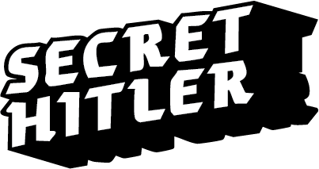

<div align="center">

# 🎭 SECRET HITLER
## *Mobile Edition*



**The Ultimate Social Deduction Game**  
*Experience political intrigue on any device*

---

### 🎮 **GAME MODES**
[](.)
[](.)
[](.)

</div>

---

## 🚀 **QUICK START**

### 📱 **Instant Play** *(Recommended)*
```bash
# Clone and serve locally
git clone https://github.com/yourusername/PassAndPlaySH.git
cd PassAndPlaySH
# Open index.html in your browser
```

### 🔧 **XAMPP Setup**
1. Install [XAMPP](https://www.apachefriends.org/)
2. Place project in `C:\xampp\htdocs\PassAndPlaySH\`
3. Start Apache service
4. Navigate to `http://localhost/PassAndPlaySH/`

### 🌐 **Plesk Hosting**
- Upload to your hosting provider
- Database preconfigured and ready
- Access via your domain

---

## ⚡ **FEATURES**

<table>
<tr>
<td width="50%">

### 🎯 **Core Gameplay**
- ✅ Complete Secret Hitler rules implementation
- 🎭 Role-based social deduction mechanics  
- 🗳️ Election and policy enactment systems
- 🔍 Investigation and execution powers
- 🏆 Multiple victory conditions

</td>
<td width="50%">

### 🔧 **Technical Features**
- 📱 Responsive mobile-first design
- 🌐 Offline & online multiplayer support
- 🎨 1930s propaganda poster aesthetic
- 🔒 Anti-cheating console protection
- 💾 Real-time game state persistence

</td>
</tr>
</table>

---

## 🎨 **DESIGN LANGUAGE**

This implementation follows our comprehensive [Design Guide](secret_hitler_design_guide.md), featuring:

<div align="center">

| **Liberal Blue** | **Fascist Red** | **Neutral Beige** | **Propaganda Black** |
|:---:|:---:|:---:|:---:|
|  |  |  |  |
| `#00AEEF` | `#DA291C` | `#D6C6A9` | `#101820` |

</div>

---

## 🏗️ **PROJECT ARCHITECTURE**

```
PassAndPlaySH/
├── 🏠 index.html              # Main entry point
├── 📱 pages/                  # Game screens
│   ├── create.html           # Game creation
│   ├── join.html             # Join game
│   ├── lobby.html            # Player lobby  
│   ├── play.html             # Main game
│   └── rules.html            # Rules reference
├── ⚡ js/                     # Core game logic
│   ├── app.js                # Main application
│   ├── gameplay.js           # Game mechanics
│   ├── db.js                 # Database layer
│   └── firebase.js           # Backend integration
├── 🎨 styles/                # UI styling
├── 🖼️ images/                # Game assets
└── 📚 fonts/                 # Typography
```

---

## 🎲 **GAMEPLAY OVERVIEW**

<div align="center">

### **THE SETUP**
*5-10 players • Hidden roles • Political intrigue*

</div>

| Players | Liberals | Fascists | Hitler |
|:-------:|:--------:|:--------:|:------:|
| **5**   | 3        | 1 + 1    | 1      |
| **6**   | 4        | 1 + 1    | 1      |
| **7**   | 4        | 2 + 1    | 1      |
| **8**   | 5        | 2 + 1    | 1      |
| **9**   | 5        | 3 + 1    | 1      |
| **10**  | 6        | 3 + 1    | 1      |

### **THE GOAL**
- 🔵 **Liberals:** Pass 5 Liberal policies *OR* assassinate Hitler
- 🔴 **Fascists:** Pass 6 Fascist policies *OR* elect Hitler as Chancellor

---

## 🛠️ **DEVELOPMENT**

### **Tech Stack**
- **Frontend:** HTML5, CSS3, JavaScript (ES6+)
- **Backend:** PHP with MySQL
- **Architecture:** RESTful API with offline fallback
- **Database:** Remote Plesk MySQL server

### **Local Development**
```bash
# Start development server
php -S localhost:8000

# Or use XAMPP for full environment
# Database connects automatically to remote server
```

### **Game State Management**
- Real-time synchronization across devices
- Automatic reconnection handling  
- Anti-cheat console protection
- Secure role distribution

---

## 📖 **DOCUMENTATION**

<div align="center">

[](GAMEPLAY.md)
[](LOCAL-DEVELOPMENT.md)
[](MYSQL-SETUP.md)
[](PROJECT-STRUCTURE.md)

</div>

---

## 🤝 **CONTRIBUTING**

We welcome contributions! Please ensure your work follows our design guide and maintains the authentic 1930s propaganda aesthetic.

1. Fork the repository
2. Create a feature branch
3. Follow the design specifications
4. Test both pass-and-play and multi-device modes
5. Submit a pull request

---

## ⚖️ **LICENSE & CREDITS**

This project is for educational and personal use.

**Original Game:** Secret Hitler by Goat, Wolf & Cabbage  
**Implementation:** Web adaptation with mobile-first design  
**Design:** Faithful recreation of 1930s propaganda aesthetic

---

<div align="center">

**🎭 Ready to play? The fate of democracy is in your hands! 🎭**

*Will you preserve liberal democracy or enable fascist rule?*

</div>