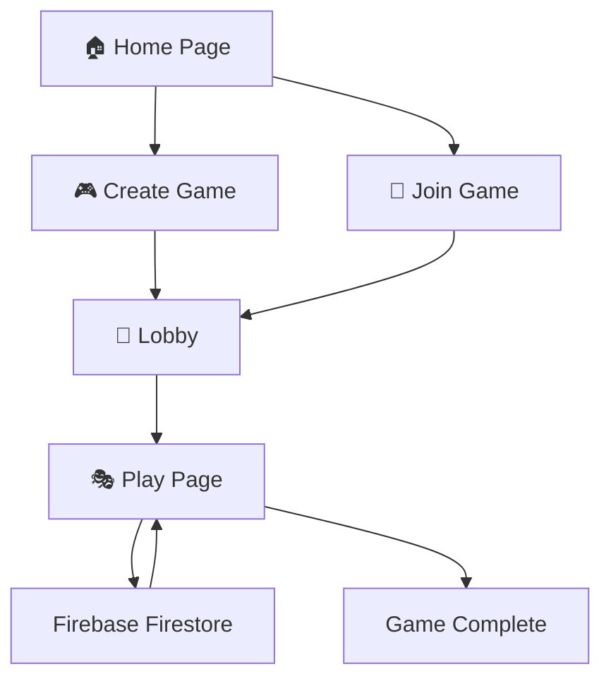

<div align="center">

# 🎭 Secret Hitler - Mobile Edition

### *The Ultimate Online Social Deduction Game*

[](https://web.dev/progressive-web-apps/)
[](https://firebase.google.com/)
[](LICENSE)
[](https://developer.mozilla.org/en-US/docs/Web/JavaScript)

**Play Secret Hitler online with friends anywhere • Multi-device support • Real-time synchronization**

[🎮 **Play Now**](#quick-start) • [📖 **Rules**](pages/rules.html) • [🛠️ **Development**](#local-development) • [📚 **Docs**](CLAUDE.md)

---

</div>

## ✨ Features

<table>
<tr>
<td width="50%">

### 🌐 **Online Multiplayer**
- Real-time Firebase synchronization
- Play with friends anywhere
- 5-10 player support
- Persistent game state

</td>
<td width="50%">

### 📱 **Multi-Device**
- Each player uses their own device
- Private role management
- Secure voting system
- Session conflict detection

</td>
</tr>
<tr>
<td width="50%">

### 🎯 **Complete Gameplay**
- Full Secret Hitler rules
- Executive powers system
- Policy deck management
- Election mechanics

</td>
<td width="50%">

### 🎨 **Modern UI**
- Responsive mobile-first design
- PWA-installable
- Smooth animations
- Theme support

</td>
</tr>
</table>

---

## 🚀 Quick Start

### 🎮 **Play Online** *(Recommended)*

1. **Visit the app** → Open in your mobile browser
2. **Create a game** → Host sets up with 5-10 player names
3. **Share game code** → Players join with the 5-character code
4. **Start playing** → Each player sees their secret role

### 💻 **Local Development**

```bash
# 1. Install XAMPP (Apache server)
# Download from https://www.apachefriends.org/

# 2. Clone repository
git clone https://github.com/yourusername/PassAndPlaySH.git
cd PassAndPlaySH

# 3. Move to XAMPP directory
# Place in: C:\xampp\htdocs\PassAndPlaySH\

# 4. Start Apache in XAMPP Control Panel

# 5. Open browser
# Navigate to: http://localhost/PassAndPlaySH/
```

**✅ That's it!** The app automatically connects to Firebase backend - no database setup needed.

---

## 🎲 Game Modes

<table>
<tr>
<td align="center" width="33%">

### 🌐 **Multi-Device**
Play online with friends<br/>
Each player has their own device<br/>
*Recommended for remote play*

</td>
<td align="center" width="33%">

### 📱 **Pass & Play**
Local multiplayer on one device<br/>
Pass device between players<br/>
*Coming Soon*

</td>
<td align="center" width="33%">

### 🎓 **Demo Mode**
Learn the game mechanics<br/>
Interactive tutorial<br/>
*Coming Soon*

</td>
</tr>
</table>

---

## 🏗️ Architecture



### 🔧 **Tech Stack**

| Layer | Technology |
|-------|-----------|
| **Frontend** | HTML5, CSS3, JavaScript ES6 Modules |
| **Backend** | Firebase Firestore (Realtime Database) |
| **Auth** | Firebase Anonymous Authentication |
| **Hosting** | XAMPP (Local) / Firebase Hosting (Production) |
| **PWA** | Service Worker, Web App Manifest |

---

## 📂 Project Structure

```
PassAndPlaySH/
├── 📄 index.html              # Home page & navigation
├── 🎨 styles/
│   ├── app.css                # Global styles
│   ├── home-modern.css        # Home page styles
│   └── rules-modern.css       # Rules page styles
├── 📜 js/
│   ├── gameplay.js            # Core game logic (2500+ lines)
│   ├── db.js                  # Firestore operations & history
│   ├── renderers.js           # Pure DOM rendering
│   ├── helpers.js             # Game rules & visibility
│   ├── session-manager.js     # Multi-tab conflict detection
│   ├── modals.js              # UI modal controllers
│   ├── firebase.js            # Firebase initialization
│   └── utils.js               # Utility functions
├── 📱 pages/
│   ├── create.html            # Game creation
│   ├── join.html              # Join existing game
│   ├── lobby.html             # Pre-game lobby
│   ├── play.html              # Main gameplay
│   └── rules.html             # Game rules
├── 🖼️ images/                  # Game assets (cards, icons)
├── ⚙️ admin/                   # Admin cleanup tools
└── 📚 CLAUDE.md               # Developer documentation
```

---

## 🎮 How to Play

### 🎯 **Objective**

<table>
<tr>
<td width="50%" align="center">

### 🔵 **Liberal Team**
✅ Pass 5 Liberal policies<br/>
✅ Assassinate Hitler

</td>
<td width="50%" align="center">

### 🔴 **Fascist Team**
✅ Pass 6 Fascist policies<br/>
✅ Elect Hitler as Chancellor (after 3 Fascist policies)

</td>
</tr>
</table>

### 📋 **Game Flow**

1. **👑 Election** → President nominates a Chancellor
2. **🗳️ Vote** → Everyone votes Ja (Yes) or Nein (No)
3. **📜 Legislation** → President draws 3 policies, discards 1
4. **🔨 Enactment** → Chancellor chooses 1 of 2 remaining policies
5. **⚡ Executive Powers** → President may use special abilities
6. **🔄 Repeat** → Presidential power passes clockwise

### ⚡ **Executive Powers** (Unlocked by Fascist Policies)

| Players | Power Unlock Order |
|---------|-------------------|
| 5-6 | 🔍 Policy Peek → 💀 Execute → 💀 Execute |
| 7-8 | 🔎 Investigate → 🎯 Special Election → 💀 Execute → 💀 Execute |
| 9-10 | 🔎 Investigate → 🔎 Investigate → 🎯 Special Election → 💀 Execute → 💀 Execute |

---

## 🔥 Firebase Integration

### 📊 **Data Model**

```javascript
games/{gameId}/
  ├── 📄 Document Fields
  │   ├── state: 'lobby' | 'active' | 'completed'
  │   ├── playerCount: number
  │   ├── createdAt, updatedAt, expireAt
  │   └── settings: { showVoteDetails }
  ├── 👥 players/{playerId}
  │   ├── name, seat, alive, role
  │   └── lastSeen (heartbeat)
  └── 📜 history/{eventId}
      ├── ts, type, message
      └── visibility: 'public' | 'private' | 'partied' | 'silent'
```

### 🔒 **History Visibility System**

| Level | Who Sees It | Usage |
|-------|------------|-------|
| **Public** | Everyone | Elections, policy enactments |
| **Private** | Specific players | Your role, investigation results |
| **Partied** | Team members | Fascist team coordination |
| **Silent** | Debug only | Internal state transitions |

---

## 🛠️ Development

### 📋 **Prerequisites**

- 🌐 [XAMPP](https://www.apachefriends.org/) - Apache server for local hosting
- 🔥 Firebase account (already configured in `js/firebase.js`)
- 🌍 Modern browser with ES6 module support

### 🚀 **Running Locally**

```bash
# 1. Start Apache in XAMPP Control Panel

# 2. Navigate to project
http://localhost/PassAndPlaySH/

# 3. Firebase connection is automatic!
```

### 🧪 **Admin Tools**

- **Cleanup Preview**: `admin/test-cleanup.html` - Dry-run of game cleanup
- **Execute Cleanup**: `admin/cleanup.html` - Remove expired games

### 🗂️ **Firestore Indexes**

Deploy custom indexes for query optimization:

```bash
firebase deploy --only firestore:indexes
```

Indexes are defined in `firestore.indexes.json`

---

## 📚 Documentation

| Document | Description |
|----------|-------------|
| [📘 CLAUDE.md](CLAUDE.md) | **Complete developer guide** - Architecture, patterns, common tasks |
| [🎮 rules.html](pages/rules.html) | Official Secret Hitler game rules |
| [🔥 Firebase Config](js/firebase.js) | Firebase initialization (API keys are public, safe to commit) |

---

## 🎯 Key Features

### ✅ **Implemented**

- ✔️ Real-time multiplayer with Firebase
- ✔️ Complete Secret Hitler game rules
- ✔️ Executive powers system (investigate, special election, policy peek, execution)
- ✔️ Private role assignment
- ✔️ Election and voting mechanics
- ✔️ Policy deck management (6 Liberal, 11 Fascist)
- ✔️ Session conflict detection
- ✔️ Game history with visibility controls
- ✔️ Mobile-responsive PWA
- ✔️ Automatic game cleanup (TTL)

### 🚧 **Coming Soon**

- ⏳ Pass-and-play mode
- ⏳ Demo/tutorial mode
- ⏳ Game statistics
- ⏳ Player achievements

---

## 🔐 Security Features

- 🔒 **Role Privacy** - Each player only sees their own role
- 🚫 **Session Guards** - Prevents multi-tab cheating
- 🔐 **Anonymous Auth** - No personal data collection
- 🎭 **Visibility System** - Event filtering based on player permissions
- 🛡️ **Client-side Protection** - Console access restricted in production

---

## 📝 Game Cleanup

**Automatic TTL Rules** (configured in `js/db.js`):

| Game State | Retention |
|------------|-----------|
| Lobby (not started) | 15 minutes |
| Completed games | 7 days |
| Abandoned games | 24 hours (no player activity) |
| Maximum age | 30 days (any state) |

---

## 🤝 Contributing

This is an educational project for personal use. Secret Hitler is a trademark of Goat Wolf & Cabbage LLC.

### 📜 **Code Guidelines**

1. **Never modify** the deprecated `Game` class in `js/app.js` (lines 783-1434)
2. **Read `js/gameplay.js` in sections** - it's 2500+ lines, use offset/limit
3. **Use ES6 modules** - all JS files use `import`/`export`
4. **Follow Firebase patterns** - use transactions for state changes
5. **Respect visibility levels** - use appropriate history logging

---

## 📄 License

This project is for **educational and personal use only**.

Secret Hitler is designed by Max Temkin, Mike Boxleiter, Tommy Maranges, and Mackenzie Schubert.
This is an unofficial fan implementation.

---

<div align="center">

### 🎭 Built with ❤️ for Social Deduction Enthusiasts

**[⭐ Star this repo](https://github.com/yourusername/PassAndPlaySH)** if you enjoy the game!

[](https://firebase.google.com/)
[](https://developer.mozilla.org/en-US/docs/Web/JavaScript)
[](https://developer.mozilla.org/en-US/docs/Web/HTML)
[](https://developer.mozilla.org/en-US/docs/Web/CSS)

---

**Made for game nights** 🎲 **Optimized for mobile** 📱 **Play anywhere** 🌍

</div>
